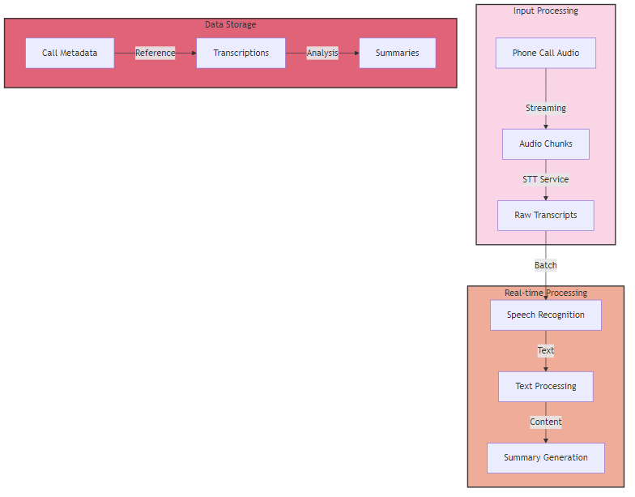
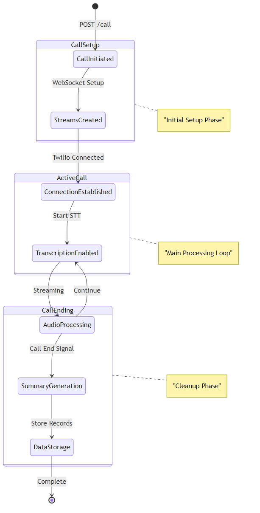
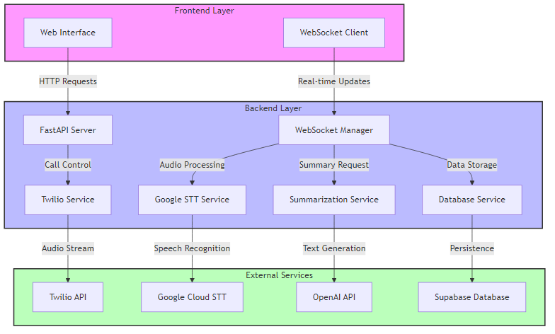
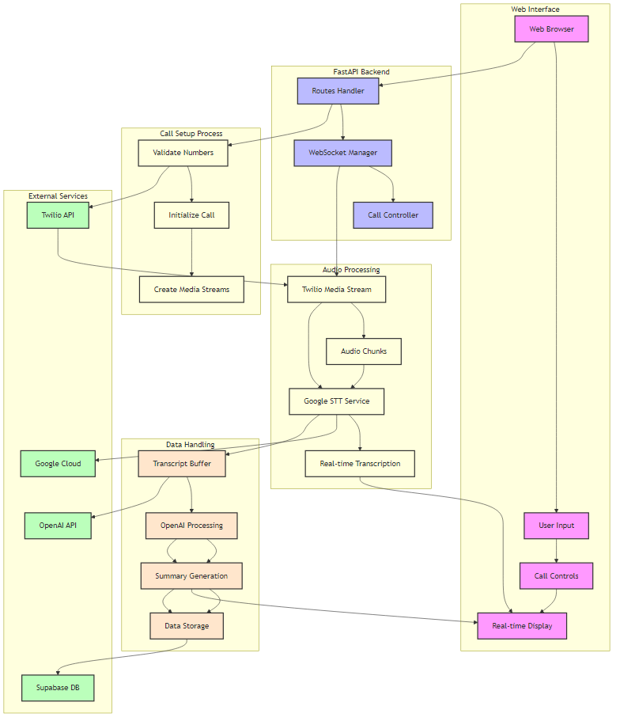

# Call Monitoring System Architecture

## System Overview

The Call Monitoring System is a real-time call tracking and analysis platform that integrates voice calls, speech-to-text transcription, and automated summarization. The system is built using a microservices architecture with several key components working together to provide seamless call monitoring and analysis capabilities.

## Core Components

### 1. Frontend Layer
- **Web Interface**: HTML/CSS-based interface for call initiation and monitoring
- **WebSocket Client**: Handles real-time updates and streaming transcriptions

### 2. Backend Services

#### FastAPI Server (`routes.py`)
- Handles HTTP endpoints for call management
- Manages WebSocket connections
- Routes incoming requests to appropriate services

#### WebSocket Manager (`websocket_service.py`)
- Manages real-time communication between components
- Coordinates audio streams and transcription data
- Handles client connections and message broadcasting

#### Twilio Service (`twilio_service.py`)
- Manages outbound call initiation
- Handles call status updates
- Configures media streams for audio capture

#### Google STT Service (`google_stt_service.py`)
- Processes real-time audio streams
- Converts speech to text
- Manages streaming recognition sessions

#### Summarization Service (`summarization_service.py`)
- Generates call summaries using OpenAI's GPT models
- Processes complete transcripts
- Extracts key information and context

#### Database Service (`database_service.py`)
- Handles data persistence using Supabase
- Stores call records, transcripts, and summaries
- Manages call metadata

## Data Flow

1. **Call Initiation**

2. **Audio Processing**
   - Raw audio captured through Twilio
   - Streamed in chunks to Google STT
   - Real-time transcription generated

3. **Data Storage**
   - Call metadata stored in Supabase
   - Transcripts saved incrementally
   - Summaries generated and stored

## State Management

## System Architecture

## Call Flow

## Complete System Interaction Flow

The above diagram illustrates the comprehensive interaction between all system components:

1. **User Interface Layer**
   - Web browser interface for user interaction
   - Real-time display of call status and transcriptions
   - Call control functionality

2. **Backend Processing**
   - FastAPI routes handling requests
   - WebSocket manager coordinating real-time communication
   - Call controller managing call lifecycle

3. **Service Integration**
   - Twilio for call management and audio streaming
   - Google Cloud for speech-to-text processing
   - OpenAI for summary generation
   - Supabase for data persistence

4. **Data Flow**
   - Audio processing pipeline
   - Real-time transcription streaming
   - Summary generation and storage
   - Database interactions

## Configuration

The system uses environment variables for configuration:

- Twilio credentials
- Google Cloud credentials
- OpenAI API key
- Supabase connection details
- NGROK settings for development

## Security Considerations

1. **Authentication**
   - Environment variables for API keys
   - Secure WebSocket connections
   - Token-based service authentication

2. **Data Protection**
   - Encrypted communication channels
   - Secure storage in Supabase
   - Temporary audio buffer management

## Development Setup

1. Clone repository
2. Set up environment variables
3. Install dependencies
4. Configure external services
5. Run development server

## External Dependencies

1. **Twilio**
   - Voice calls
   - Media streaming
   - Call status management

2. **Google Cloud**
   - Speech-to-Text API
   - Real-time transcription
   - Audio processing

3. **OpenAI**
   - GPT models
   - Summary generation
   - Context analysis

4. **Supabase**
   - Data storage
   - Call records
   - Transcript archives

## Performance Considerations

1. **Real-time Processing**
   - Efficient audio streaming
   - Optimized STT processing
   - WebSocket management

2. **Scalability**
   - Stateless design
   - Service isolation
   - Resource management

3. **Error Handling**
   - Graceful degradation
   - Service recovery
   - Connection management
