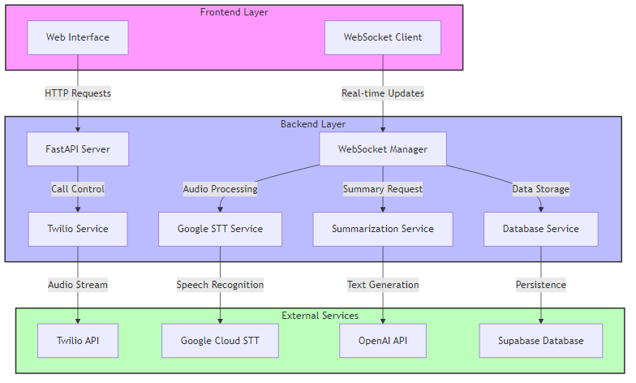
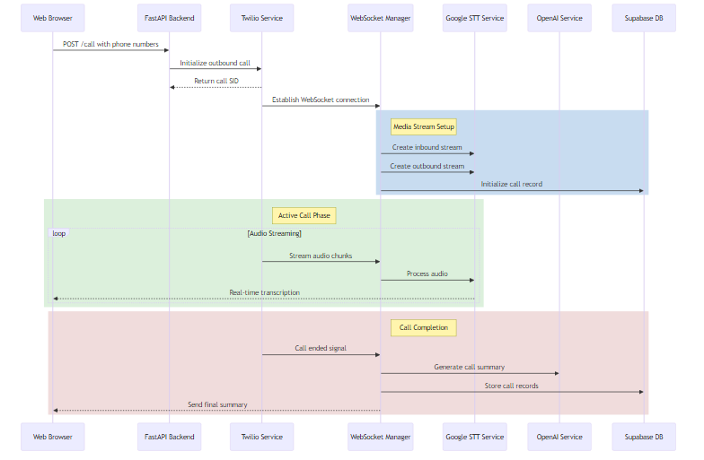
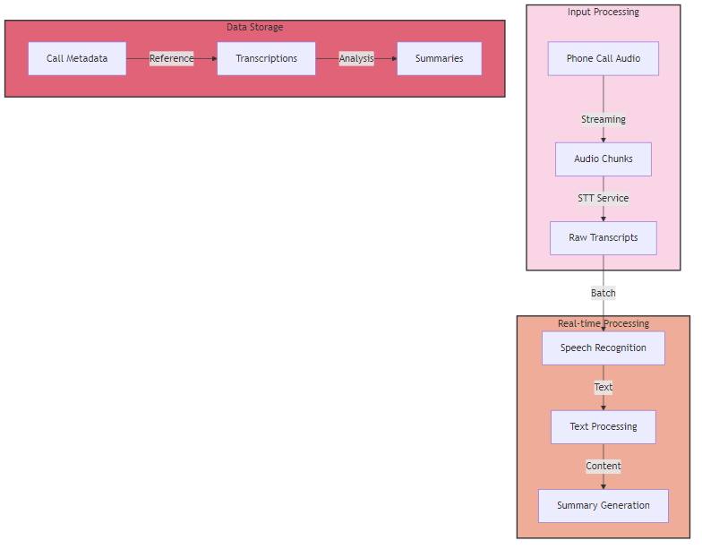
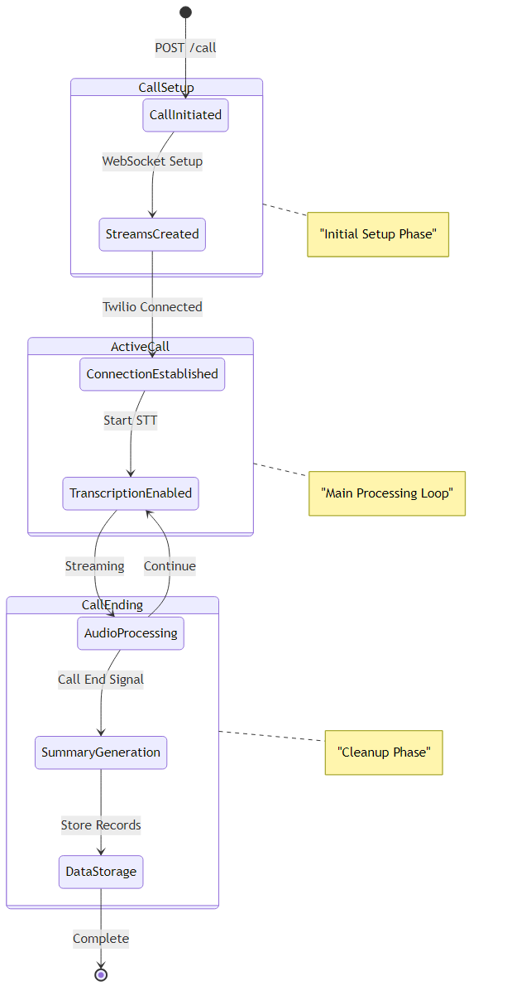
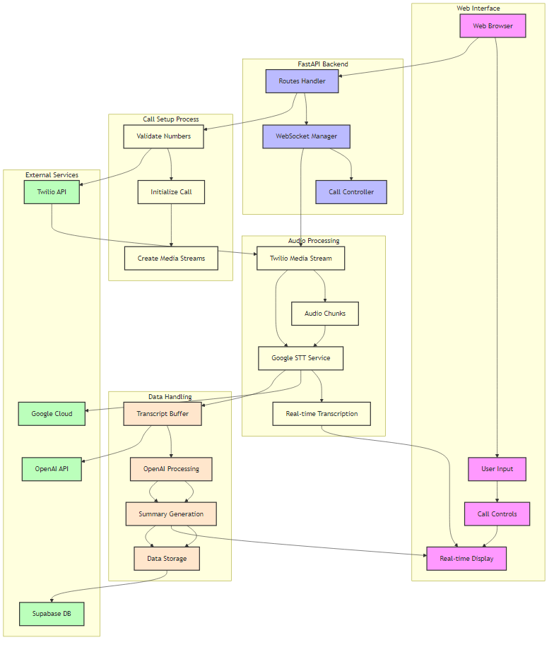

# Call Monitoring System

A real-time call monitoring system that provides speech-to-text transcription, conversation analysis, and automated summarization.

## Features

- Real-time call transcription using Google Speech-to-Text
- Automated call summarization using OpenAI GPT models
- Live call monitoring through WebSocket connections
- Call metadata and transcript storage in Supabase
- Twilio integration for voice calls
- Web interface for call management

## System Architecture



The system consists of multiple services working together:

### Call Flow


### Data Processing


### State Management


### Complete System Flow


This diagram shows the complete interaction between all system components from user input to data storage. For detailed architecture information, see [ARCHITECTURE.md](ARCHITECTURE.md).

## Prerequisites

- Python 3.8+
- Twilio Account
- Google Cloud Account with Speech-to-Text API enabled
- OpenAI API key
- Supabase Account
- Ngrok (for development)

## Installation

1. Clone the repository
```bash
git clone <repository-url>
cd Google_STT_Dialer
```

2. Install dependencies
```bash
pip install -r requirements.txt
```

3. Set up environment variables:

   a. Copy the example environment file:
   ```bash
   cp .env.example .env
   ```

   b. Update the `.env` file with your credentials:

   - **Twilio Configuration**
     - Get your Account SID and Auth Token from [Twilio Console](https://www.twilio.com/console)
     - Set up a Twilio phone number in your account
   
   - **Phone Numbers**
     - Add verified caller number (must be verified in Twilio)
     - Add receiver number
   
   - **Ngrok Configuration**
     - Get your auth token from [Ngrok Dashboard](https://dashboard.ngrok.com)
     - Enable for development, disable in production
   
   - **Supabase Configuration**
     - Get URL and anon key from your [Supabase Project Settings](https://app.supabase.io)
   
   - **OpenAI Configuration**
     - Get API key from [OpenAI Dashboard](https://platform.openai.com/api-keys)
   
   - **Google Cloud Configuration**
     - Create a service account and download credentials file
     - Place the JSON file in the project root
     - Set the GOOGLE_APPLICATION_CREDENTIALS environment variable

4. Configure Google Cloud credentials:
- Place your Google Cloud service account key in `call-analyzer.json`
- Set GOOGLE_APPLICATION_CREDENTIALS environment variable:
```bash
export GOOGLE_APPLICATION_CREDENTIALS="path/to/call-analyzer.json"
```

## Usage

1. Start the server:
```bash
python run.py
```

2. Access the web interface at `http://localhost:5000`

3. Make a call:
   - Enter the caller and receiver phone numbers
   - Click "Start Call"
   - Monitor the call in real-time

## API Endpoints

### HTTP Endpoints

- `GET /` - Web interface
- `POST /call` - Start a new call
- `POST /call_status` - Handle call status updates
- `POST /toggle_transcription` - Enable/disable transcription

### WebSocket Endpoints

- `/twilio` - Twilio media stream connection
- `/ws` - Client connection for real-time updates

## Development

1. Run with hot reload:
```bash
python run.py
```

2. Enable Ngrok for Twilio webhook:
```bash
ngrok http 5000
```

## Contributing

1. Fork the repository
2. Create a feature branch
3. Commit your changes
4. Push to the branch
5. Create a pull request

## License

This project is licensed under the MIT License - see the LICENSE file for details.
